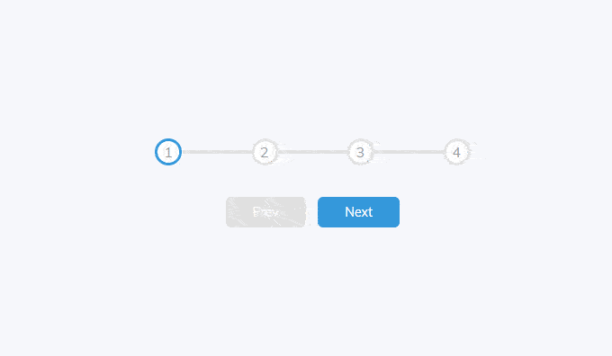

<h1 align="center">
  
  <br/>
</h1>

<p align="center">
  

  

  <a href="https://github.com/raphabarreto/progress-steps/commits/master">
    
  </a>

  <a href="https://github.com/raphabarreto/progress-steps/issues">
    
  </a>

  <a href="https://github.com/raphabarreto/progress-steps/blob/master/LICENSE.md">
    
  <a>

  <a href="https://app.netlify.com/sites/progress-steps-raphaelbarreto/deploys">
    
  <a>
</p>

<p align="center">
  <a href="#-tecnologias">Tecnologias</a>&nbsp;&nbsp;&nbsp;|&nbsp;&nbsp;&nbsp;
  <a href="#-projeto">Projeto</a>&nbsp;&nbsp;&nbsp;|&nbsp;&nbsp;&nbsp;
  <a href="#-instalação">Instalação</a>&nbsp;&nbsp;&nbsp;|&nbsp;&nbsp;&nbsp;
  <a href="#-instalação">Como contribuir</a>&nbsp;&nbsp;&nbsp;|&nbsp;&nbsp;&nbsp;
  <a href="#-licença">Licença</a>
</p>

<br>

---

## ✨ Demonstração

<p >Acesse <a href="https://progress-steps.raphabarreto.com.br/">aqui</a> para ver a demonstração do resultado final.</p>

---

## 🚀 Tecnologias

Esse projeto foi desenvolvido com as seguintes tecnologias:

- [HTML 5](https://developer.mozilla.org/pt-BR/docs/Web/HTML/HTML5)
- [CSS 3](https://developer.mozilla.org/pt-BR/docs/Web/CSS)
- [JavaScript](https://developer.mozilla.org/pt-BR/docs/Web/JavaScript)

---

## 💻 Projeto

Esta aplicação foi construída para demonstrar uma barra de progressão, que é uma funcionalidade bem difundida, principalmente em sistemas E-commerce.

---

## 🌐 Resultado

<h1 align="center">
    
</h1>

## 🔥 Instalação

```bash
# Clone este repositório
$ git clone git@github.com:raphabarreto/progress-steps.git

# Navegue para a pasta raiz do projeto e instale as dependências:
$ yarn install

# Abre o arquivo index.html no seu navegador ou através do Live Server do Visual Studio Code

```

---

## 🤔 Como contribuir

- Faça um fork desse repositório;
- Cria uma branch com a sua feature: `git checkout -b minha-feature`;
- Faça commit das suas alterações: `git commit -m 'feat: Minha nova feature'`;
- Faça push para a sua branch: `git push origin minha-feature`.

Depois que o merge da sua pull request for feito, você pode deletar a sua branch.

---

## 🧾 Licença

Esse projeto está sob a licença MIT. Veja o arquivo [LICENSE](LICENSE.md) para mais detalhes.

---

Feito com 💗 by [Raphael Barreto](https://bit.ly/contato-linkedin)
